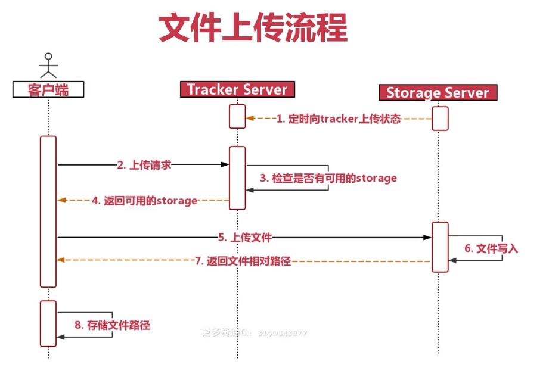

# netty & springBoot 开发仿微信聊天

## 目录
```
├─main
│  ├─java
│  │  ├─com
│  │  │  └─xiaao
│  │  │      └─wechat
│  │  │          │  FastDFSImporter.java            // FastDFS启动
│  │  │          │  NettyBooter.java                // neety启动
│  │  │          │  WarStartApplication.java        // war包启动方式 
│  │  │          │  WechatApplication.java          // 项目main函数启动
│  │  │          │
│  │  │          ├─controller
│  │  │          │      UserController.java         // 用户接口controller
│  │  │          │  
│  │  │          ├─enums                            // 枚举类型
│  │  │          │      MsgActionEnum.java          // 消息类型枚举
│  │  │          │      MsgSignFlagEnum.java        // 消息签收状态枚举
│  │  │          │      OperatorFriendRequestTypeEnum.java  // 操作好友请求状态枚举
│  │  │          │      SearchFriendsStatusEnum.java    // 查找好友结果枚举
│  │  │          │
│  │  │          ├─mapper                           // mapper包
│  │  │          │      ChatMsgMapper.java          // 聊天消息
│  │  │          │      FriendsRequestMapper.java   // 好友请求
│  │  │          │      MyFriendsMapper.java        // 我的好友
│  │  │          │      UsersMapper.java            // 用户表
│  │  │          │      UsersMapperCustom.java      // 自定义mapper
│  │  │          │
│  │  │          ├─netty                            // netty
│  │  │          │      ChatHandler.java            // 聊天操作处理，channel
│  │  │          │      ChatMessage.java            // 定义chatMessage关键字段序列化
│  │  │          │      DataContent.java            // 定义数据内容序列化
│  │  │          │      HeartBeatHandler.java       // 心跳处理
│  │  │          │      UserChannelRel.java         // 用户和channel关联
│  │  │          │      WSServer.java               // webSocket启动
│  │  │          │      WSServerInitializer.java    // webSocket初始化
│  │  │          │
│  │  │          ├─pojo                             // myBatis逆向生成pojo
│  │  │          │  │  ChatMsg.java                 // 聊天消息表 字段
│  │  │          │  │  FriendsRequest.java          // 好友请求表 字段
│  │  │          │  │  MyFriends.java               // 好友表 字段
│  │  │          │  │  Users.java                   // 用户表 字段
│  │  │          │  │
│  │  │          │  ├─bo                            // 自定义输入过滤
│  │  │          │  │      UsersBo.java             // 用户信息输入过滤
│  │  │          │  │
│  │  │          │  └─vo                            // 自定义返回给前端结果 信息过滤
│  │  │          │          FriendRequestVo.java    // 好友请求返回结果过滤
│  │  │          │          MyFriendsVo.java        // 我的好友查询结果 过滤
│  │  │          │          UsersVo.java            // 用户信息结果 过滤
│  │  │          │
│  │  │          ├─service                          // 服务 -核心部分
│  │  │          │      UserService.java            // 用户服务结接口
│  │  │          │      UserServiceImpl.java        // 用户服务接口实现
│  │  │          │  
│  │  │          └─utils                            // 工具类
│  │  │                  FastDFSClient.java         // FastDFS 客户端
│  │  │                  FileUtils.java             // 文件处理插件
│  │  │                  IMoocJSONResult.java       // 自定义JSON返回结果
│  │  │                  JsonUtils.java             // JSON工具
│  │  │                  MD5Utils.java              // MD5加密工具
│  │  │                  MyMapper.java              // 
│  │  │                  QRCodeUtils.java           // 生成二维码插件
│  │  │                  SpringUtils.java           // 自定义SpringUtils工具
│  │  │
│  │  └─org
│  │      └─n3r
│  │          └─idworker                            // idworker插件
│  │             
│  └─resources                                      // resources 配置
│      │  application.properties                    // 配置
│      │
│      ├─mapper                                     // xml mapper
│      │      ChatMsgMapper.xml
│      │      FriendsRequestMapper.xml
│      │      MyFriendsMapper.xml
│      │      UsersMapper.xml
│      │      UsersMapperCustom.xml
│      │
│      ├─static
│      └─templates
└─test
    └─java.com.xiaao.wechat
                        WechatApplicationTests.java  // 测试代码
```

## Key Point

### netty
NIO非阻塞式，通过事件机制，封装Java的NIO，因为源生Java的NIO并不好用，而且还有bug（网上说的，我也不知道），

```java
public WSServer() {
    mainGroup = new NioEventLoopGroup();
    subGroup = new NioEventLoopGroup();
    server = new ServerBootstrap();
    server.group(mainGroup, subGroup)
            .channel(NioServerSocketChannel.class)
            .childHandler(new WSServerInitializer());
}
```

参考：
[Netty 系列之 Netty 线程模型](https://www.infoq.cn/article/netty-threading-model)，
我看的也不是很懂，这个例子大概知道是干嘛的，具体的使用后续如果有项目结合起来回过来看。

### webSocket


#### 实时通信
* Ajax轮询
* Long pull 类似定时查询
* webSocket  持久化

### fastDFS 分布式文件系统




## 问题？

1. xml中SQL语句的意思，学习基本SQL语言
2. 枚举类型的特点
3. writeAndFlush
    netty源码中的API， 写队列并刷新。 [netty源码分析之writeAndFlush全解析](https://www.jianshu.com/p/feaeaab2ce56)中有详细介绍原理

4. textWebSocketFrame
    netty中对webSocket帧处理API
5. <>泛型？
6. hashMap 在java中的应用
